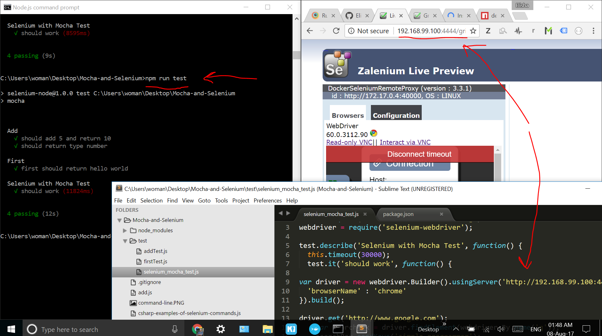
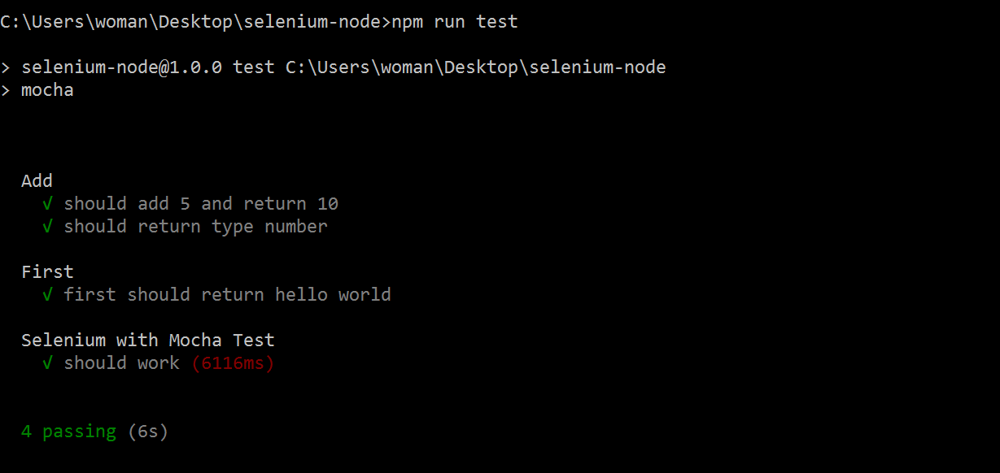

Steps to running these tests: 

1) Clone the repo

2) NPM install the dependencies

3) Cd into the root directory, and type:

"npm run test"

If all goes well, you'll see this result:

Other Resource:

<a href="https://www.udemy.com/selenium-with-c/">Udemy Course: Selenium Webdriver Complete Course - Build A Framework (in C#)</a>

<a href="https://www.youtube.com/watch?v=sPyb6QlgBaU">Unit Testing with Mocha</a>

<a href="https://www.youtube.com/watch?v=X3pTXG9a1oQ">Launching Chrome via Command Line with NodeJS and Selenium</a>

<a href="https://simpleprogrammer.com/2014/02/03/selenium-with-node-js/">Selenium With Node.js and Mocha: Automated Testing With JavaScript</a>

